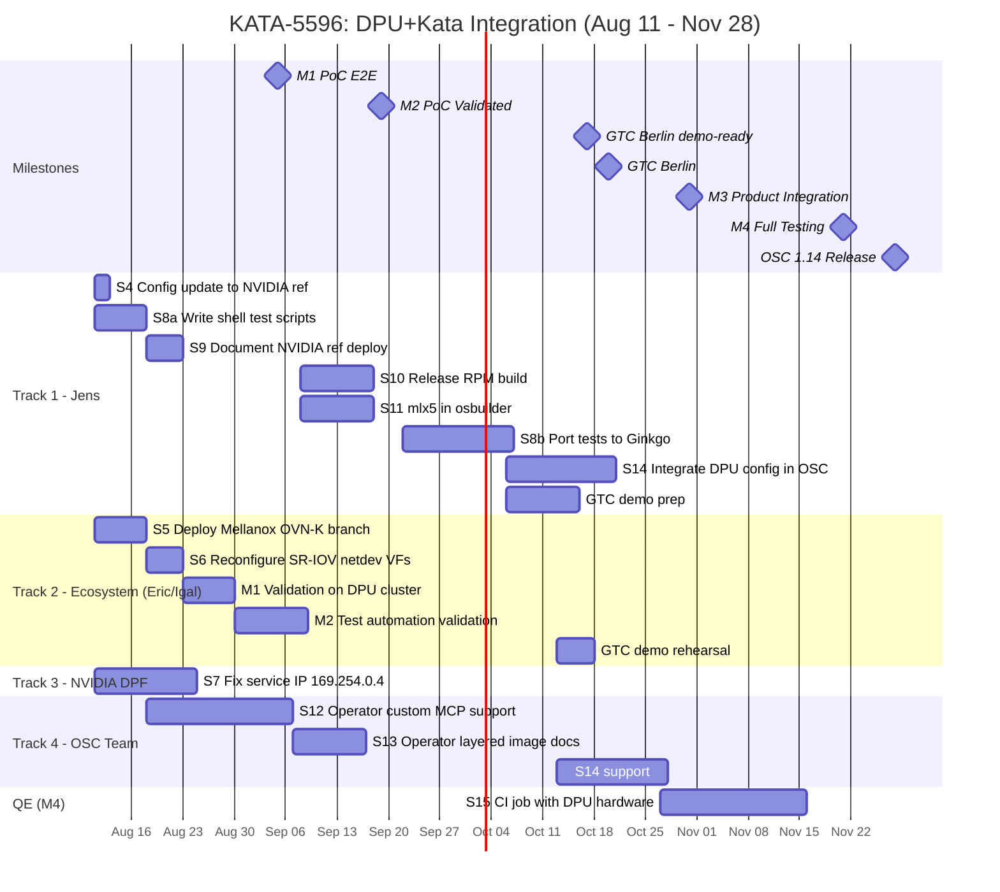

# DPU+Kata Timeline: Aug 11 - Nov 28 (16 weeks)

## Key Dates

- **GTC Berlin:** Oct 20-22 (demo deadline: Oct 17)
- **OSC 1.14 Release:** Nov 28

## Parallel Tracks

Four teams can work simultaneously:

```
Track 1 (Jens):        S4 → S8a → S9 → S10+S11 → S8b → S14
Track 2 (Ecosystem):   S5 → S6 → M1 validation → GTC demo prep
Track 3 (NVIDIA DPF):  S7 (independent)
Track 4 (OSC team):    S12 → S13 → S14
```

## Gantt Chart



## Phase Plan

### Phase 1: PoC (Aug 11 - Sep 5) -- 4 weeks

| Week | Jens (Track 1) | Ecosystem (Track 2) | NVIDIA (Track 3) | OSC Team (Track 4) |
|------|---------------|---------------------|-------------------|---------------------|
| Aug 11-15 | S4: Config update, S8a: Start test scripts | S5: Deploy Mellanox OVN-K | S7: Start service IP fix | |
| Aug 18-22 | S8a: Complete, S9: Start docs | S6: Reconfigure SR-IOV netdev | S7: Continue | S12: Start operator MCP fix |
| Aug 25-29 | S9: Complete | M1 validation on DPU cluster | S7: Complete | S12: Continue |
| Sep 1-5 | Support M1 validation | **M1 COMPLETE** | | S12: Continue |

### Phase 2: PoC Validated (Sep 5 - Sep 19) -- 2 weeks

| Week | Jens | Ecosystem | OSC Team |
|------|------|-----------|----------|
| Sep 8-12 | S10: Start release RPM, S11: Start osbuilder | M2: Validate test automation | S12: Continue |
| Sep 15-19 | S10+S11: Complete | **M2 COMPLETE** | S12: Complete |

### Phase 3: Product Integration (Sep 22 - Oct 31) -- 6 weeks

| Week | Jens | Ecosystem | OSC Team |
|------|------|-----------|----------|
| Sep 22-26 | S8b: Start Ginkgo test porting | | S13: Start operator layered image |
| Sep 29-Oct 3 | S8b: Continue | | S13: Continue |
| Oct 6-10 | S14: Start DPU config integration, GTC prep | | S13: Complete, S14: Support |
| Oct 13-17 | S14: Continue, **GTC demo-ready** | GTC demo rehearsal | S14: Continue |
| **Oct 20-22** | **GTC BERLIN** | **GTC BERLIN** | |
| Oct 27-31 | S14: Complete, S8b: Complete | | **M3 COMPLETE** |

### Phase 4: Full Testing (Nov 1 - Nov 28) -- 4 weeks

| Week | Jens | QE Team |
|------|------|---------|
| Nov 3-7 | Support CI setup | S15: Set up DPU CI job |
| Nov 10-14 | Fix test failures | S15: Run full suite |
| Nov 17-21 | | **M4 COMPLETE** (3 green runs) |
| Nov 24-28 | | **OSC 1.14 RELEASE** |

## Critical Path

```
S5 (deploy OVN-K) → S6 (reconfig SR-IOV) → M1 validation → M2 → S10+S11 → S8b+S14 → GTC demo → M3 → M4 → Release
     Week 1              Week 2            Week 3-4       Week 5-6   Week 7-10     Oct 20   Oct 31  Nov 21  Nov 28
```

## Risks

| Risk | Impact | Mitigation |
|------|--------|------------|
| Ecosystem can't deploy OVN-K in Week 1 | M1 slips, GTC at risk | Get image from Soule now |
| Service IP (S7) not fixed | Testing needs workaround | Keep manual route, don't block |
| Victor's PR #2515 not merged by Sep 22 | S8b delayed | Start own Ginkgo file, rebase later |
| Operator MCP fix (S12) takes >3 weeks | S14 delayed | Use kataConfigPoolSelector workaround |
| DPU hardware not available for CI (S15) | M4 delayed | Manual testing until hardware arrives |
| GTC demo fails live | Embarrassment | Rehearse Oct 13-17, have video backup |

## What Can Start TODAY (Aug 11)

1. **Jens**: Update config.d to NVIDIA reference (S4) -- 2 hours
2. **Jens**: Start writing test scripts (S8a) -- no cluster needed
3. **Eric/Igal**: Ask Soule for Mellanox OVN-K image/Helm (S5 prep)
4. **Jens**: Ask NVIDIA DPF about 169.254.0.4 in #ext-dpf-redhat (S7)
5. **Jens**: Share this timeline with the team
