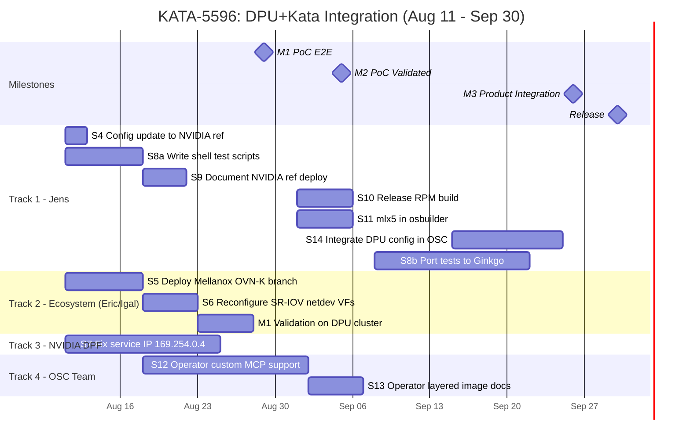

# DPU+Kata Timeline: Aug 11 - Sep 30 (7 weeks)

## Parallel Tracks

Four teams can work simultaneously:

```
Track 1 (Jens):        S4 → S8a → S9 → S10+S11 → S14 → S8b
Track 2 (Ecosystem):   S5 → S6 → M1 validation
Track 3 (NVIDIA DPF):  S7 (independent)
Track 4 (OSC team):    S12 → S13 → S14
```

## Gantt Chart



## Week-by-Week Plan

### Week 1: Aug 11-15
| Who | What | Deliverable |
|-----|------|-------------|
| Jens | S4: Update config.d to NVIDIA reference (cold-plug, vfio_mode, etc.) | Updated MachineConfig YAML in repo |
| Jens | S8a: Start writing smoke-test.sh, e2e-test.sh | Test scripts drafted |
| Eric/Igal | S5: Deploy Mellanox OVN-K branch (v26.04-ocp-kata) | Webhook with RuntimeClass mapping active |
| NVIDIA DPF | S7: Begin investigating 169.254.0.4 gateway | Diagnosis started |

### Week 2: Aug 18-22
| Who | What | Deliverable |
|-----|------|-------------|
| Jens | S8a: Complete test scripts | smoke-test.sh, e2e-test.sh in repo |
| Jens | S9: Start documenting NVIDIA reference deployment | Draft document |
| Eric | S6: Reconfigure SR-IOV -- apply NodeSRIOVDevicePluginConfig (netdev VFs 41-45) | VFs advertised as netdev |
| OSC team | S12: Start operator MCP fix (analysis done, code change needed) | Branch with fix |

### Week 3: Aug 25-29
| Who | What | Deliverable |
|-----|------|-------------|
| Jens + Eric | **M1 VALIDATION**: Run smoke + E2E tests on DPU cluster | Test results |
| Jens | S9: Complete documentation | Document in repo |
| NVIDIA DPF | S7: Service IP fix deployed | 169.254.0.4 responds |
| OSC team | S12: Continue operator MCP fix | PR open |

### Week 4: Sep 1-5
| Who | What | Deliverable |
|-----|------|-------------|
| | **M1: PoC E2E COMPLETE** | SMOKE 1-5 + E2E 1-11 pass |
| | **M2: PoC Validated COMPLETE** | deploy.sh + test scripts pass |
| Jens | S10: Start release RPM build | Patches in dist-git |
| Jens | S11: Start mlx5 osbuilder change | PR to confidential-compute-artifacts |
| OSC team | S12: Complete operator MCP fix | PR merged |
| OSC team | S13: Start operator layered image testing | Testing started |

### Week 5: Sep 8-12
| Who | What | Deliverable |
|-----|------|-------------|
| Jens | S10: Release build done, RPM tagged | RPM in RHCOS extension repo |
| Jens | S11: osbuilder change merged | mlx5 in production initrd |
| Jens | S8b: Start porting tests to Victor's Ginkgo suite | kata_dpu_test.go drafted |
| OSC team | S13: Complete operator layered image | Documented and tested |

### Week 6: Sep 15-19
| Who | What | Deliverable |
|-----|------|-------------|
| Jens | S14: Start integrating DPU config into OSC product | Config in RPM spec or operator |
| Jens | S8b: Continue Ginkgo test porting | Tests compiling |
| OSC team | S14: Support Jens on integration | Decisions on RPM vs operator |

### Week 7: Sep 22-26
| Who | What | Deliverable |
|-----|------|-------------|
| Jens | S14: Complete | DPU config ships through product channels |
| Jens | S8b: Complete Ginkgo tests | Tests in operator repo, tagged [DPU] |
| All | **M3 VALIDATION**: E2E 1-14 on standard OSC deployment | Test results |

### Sep 29-30
| Who | What | Deliverable |
|-----|------|-------------|
| | **M3: Product Integration COMPLETE** | All tests pass without RHCOS layer |
| | **Release candidate** | Ready for z-stream or 1.14 |

## Critical Path

```
S5 (deploy OVN-K) → S6 (reconfigure SR-IOV) → M1 validation → M2 → S10+S11 → S14 → M3
         Week 1          Week 2              Week 3         Week 4   Week 5    Week 6-7
```

If S5 slips, everything slips. The ecosystem team deploying the Mellanox OVN-K
branch is the gate for the entire timeline.

## Risks to September 30

| Risk | Impact | Mitigation |
|------|--------|------------|
| Ecosystem team can't deploy Mellanox OVN-K in Week 1 | M1 slips, everything slips | Pre-stage: get the image/Helm from Soule now |
| Service IP gateway (S7) not fixed by NVIDIA | Testing blocked, workaround needed | Keep the manual route workaround, don't block on this |
| Victor's PR #2515 not merged by Sep 8 | S8b can't start on time | Start with our own Ginkgo file, rebase onto Victor's later |
| Operator MCP fix (S12) takes longer than 3 weeks | S14 delayed | S14 can use workaround (kataConfigPoolSelector to dummy label) |
| Release build blocked by CVE patches or Go version | S10 delayed | Start dist-git prep in Week 2, don't wait for M1 |

## What Can Start TODAY (Aug 11)

1. **Jens**: Update config.d to NVIDIA reference (S4) -- 2 hours of work
2. **Jens**: Start writing test scripts (S8a) -- shell scripts, no cluster needed
3. **Eric/Igal**: Ask Soule for the Mellanox OVN-K image/Helm chart (S5 prep)
4. **Jens**: Ask NVIDIA DPF team about 169.254.0.4 in #ext-dpf-redhat (S7)
5. **Jens**: Share this timeline with the team
